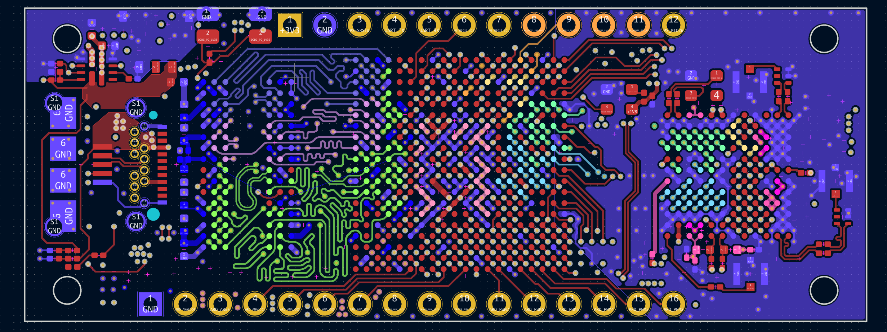
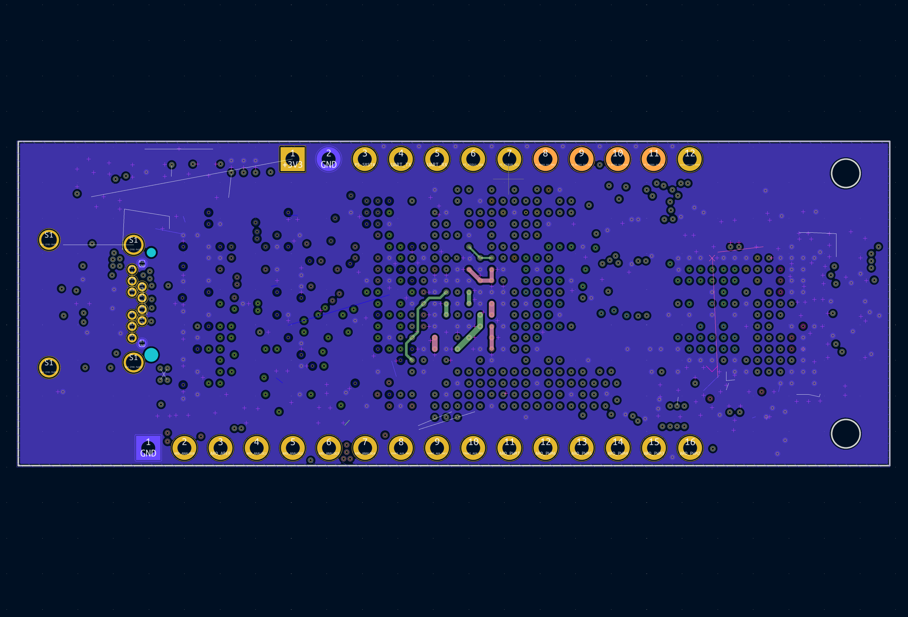
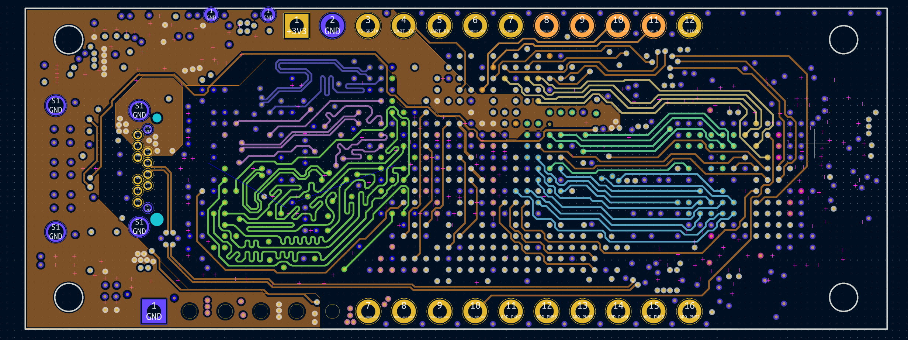
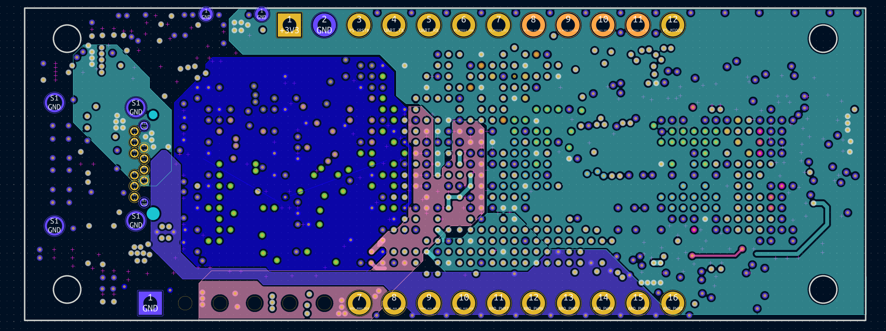
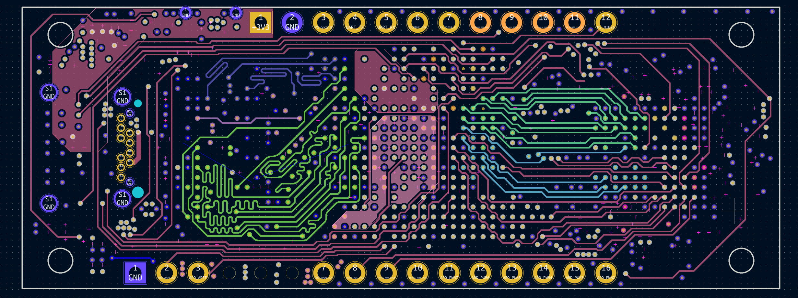
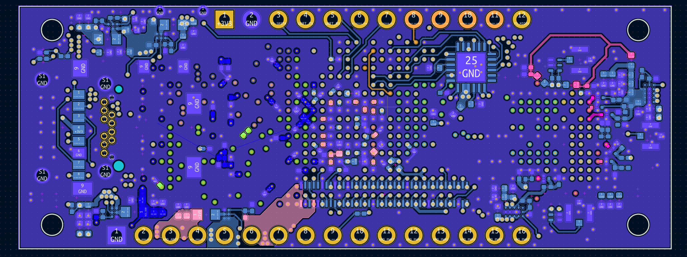
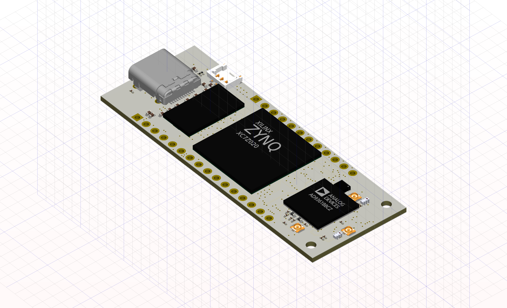
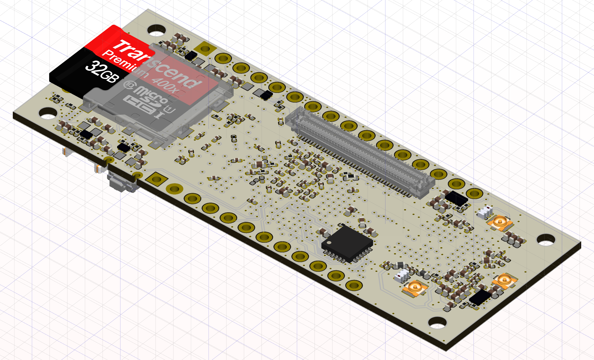

# Description
This PCB project was initially started as an exercise of learning KiCAD.  
这个PCB最初是作为学习KiCAD的练习开始的。  
And it is currently working with KiCAD 6.99.  
目前在KiCAD 6.99下进行工作。  
It is composed of a ZYNQ of 7z010 or 7z020, a AD936x RF transceiver, and some necessary peripheral circuits.  
它包含一个7z010或者7z020，一个AD936x收发器和一些必要的外围电路。  
Right now, the main layout is completed, but probably, there will still be some major changes in the future.  
现在主要部分的布线已经完成，但可能后续仍然会有大的改动。  
Due to the restriction of the layers, there remain some problems, such as trance across a split plane.  
受限于板层，还有一些问题比如布线跨分割。  
Subsequently I may need to do some FEM simulations, but I don't know how to export the KiCAD project to formats recognized by FEM tools.  
后续我可能需要做一些FEM模拟，但是目前为止我还不知道怎么将KiCAD的文件导出成FEM工具识别的格式。  
I can only do this with my spare time, so it will not be fast.  
我只能用业余时间做这件事，所以不会很快。  

# Goals
 - Matching Arduino MKR's size
 - Using a USB-C or USB micro B connector
 - As cheap as possible, avoiding complex craft like HDI or blind hole
 - Fan out pins as many as possible
 - DDR3 clock up to 1066
 - Boot by SD-Card
 - Compatible with the ADALM pluto Firmware
 - Compatible with Openwifi

# Things not done yet
 - Refactoring the format of schematics 
 - USB C master and slaver selection circuit
 - Simulation to ensure DDR signal Integrity performance
 - Test TPS2121 hot swap function
...

# Compromise
 - Transceiver data traces routing
 - USB HS signal reference plane too narrow
 - USB ULPI not be tuned (length difference <10mm)
 - LTCC balun instead of broadband balun, BLNK2-252R+(2.4-2.5GHz)/TCO1-462+(3.3-5.9GHz) seems OK
 - All DDR3 VREF is generated by different partial voltage resistors
 - Cannot meet the analog pin multiplexing function of Arduino. there is a suitable device AD5593R, there is no space to add the chip on this board, maybe this device can used at next major version
 - SD Card and USB connector shield is connected to GND
 - Router trace in DIP pin gap
 - USB PHY SPK Pin is connected to GND, beacause the bottom reference plane is splited in chip area. connect to GND to creating current return path.
 - ZYNQ boot configure pin is fixed, its means bank0 IO voltage cannot be set to 3.3V
 - Via in pad

Current img

